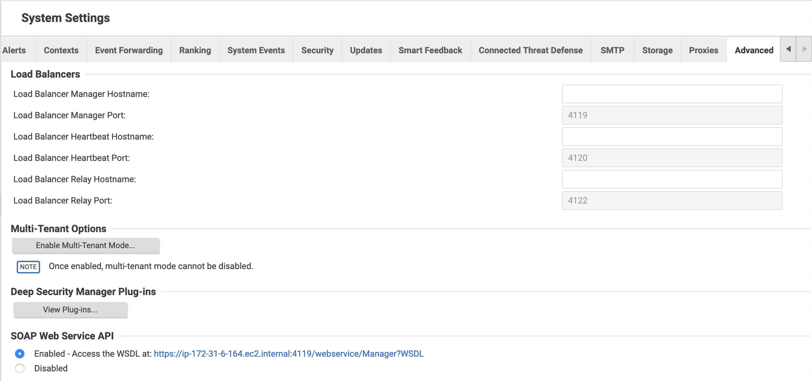
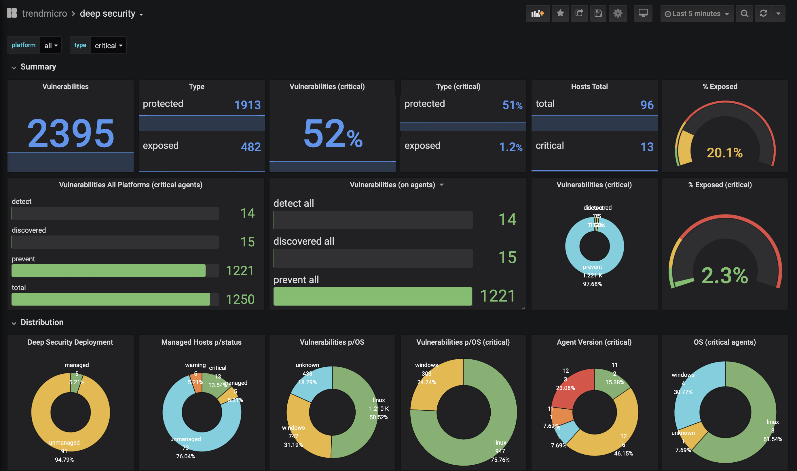
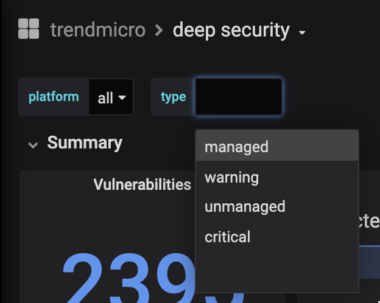

# 1. tmds11-exporter

This project creates a prometheus collector getting metrics from Deep Security DSM 11.0.

The data is aggregated in count and segmented in 3 groups:

* deep_security_computers
* deep_security_modules
* deep_security_vulnerabilities

## 1.1 prometheus labels

* **deep_security_computers**
    * labels:
        * metric: *platform* | *os_type* | *agent_version* | *agent_version_major* 
        * type: *managed* | *warning* | *critical* | *unmanaged* | *offline* | *unknown*
        * platform: *all* | *linux* | *windows*
        * status: *(os version)* | *(agent version)*
  
* **deep_security_modules**
    * labels:
       * metric: *am_status* | *wr_status* | *fw_status* | *ip_status* | *im_status* | *li_status*
       * type: *managed* | *warning* | *critical* | *unmanaged* | *offline* | *unknown*
       * platform: *all* | *linux* | *windows*
       * status: *on* | *off*
  
* **deep_security_vulnerabilities**
    * labels:
       * metric: *am_status* | *wr_status* | *fw_status* | *ip_status* | *im_status* | *li_status*
       * type: *managed* | *warning* | *critical* | *unmanaged* | *offline* | *unknown*
       * platform: *linux* | *windows*
       * status: *all* | *discovered* | *detect* | *prevent*

About vulnerabilities status:

* **discovered:** vulnerabilities that are detected but the IPS is not enabled on the host
* **detect:** vulnerabilities with IPS enabled but configured on detect mode
* **prevent:** vulnerabilities with IPS enabled and configured on prevent mode

## 1.2 environment:

* **python**: *python 2.7* (required)
* **prometheus**: *v2.16* (tested with this version)
* **grafana**: *6.6.2* (tested with this version)

## 1.3 configuration

### 1.3.1 create a virtual environment

#### 1.3.1.1 virtualenv

~~~
virtualenv venv
source venv/bin/activate
pip install -r requirements.txt
~~~

#### 1.3.1.2 pipenv

~~~sh
pipenv --two
pipenv shell
pip install -r requiriments.txt
~~~

### 1.3.2 running the app:

You should configure a config.py (**renaming config_sample.py to config.py** with your configuration), or using environment variables, to configure:

| Variable    | Description                    | Value                          | Value Type  |
|-------------|--------------------------------|--------------------------------|-------------|
|DS_HOST      | DSM Hostname                   | ip|fqdn                        | string|
|DS_PORT      | DSM TCP Port                   | port Number                    | string|
|DS_USER      | User Account (read only)       | user_name - base64 encoded     | string|
|DS_PASS      | User Password                  | user_pass - base64 encoded     | string|
|DS_VERIFY_SSL| SSL Verify                     | True|False                     | boolean|
|DS_API_CHECK | Cache API data                 | time in minutes                | integer|
|SERVER_PORT  | Prometheus Collector TCP Port  | port number                    | integer|
|LOG_LEVEL    | Log level                      | INFO|WARN|DEBUG|ERROR|CRITICAL | string|

To encode your credentials:

~~~sh
echo -ne '<ds_user>'|base64
echo -ne '<ds_pass>'|base64
~~~

### 1.3.3 enabling soap web api

We need to enable SOAP Web API on the DSM. To do it, you should to to:

* *Administration* tab
* * System settings* pane
* *SOAP Web Service API* option - check '**enable**' radio button

### 1.3.4 grafana dashboard:

Import the dashboard located on: grafana/dash.json

* **dashboard:**

* **filtering by type:** 
  

## 1.4 executing the collector with supervisor

### 1.4.1 creating a zip file with all the dependencies (on redhat)

~~~sh
easy_install pip
pip install virtualenv
virtualenv venv
source venv/bin/activate
pip install -r requirements.txt
~~~

checking supervisord:

~~~
./venv/bin/supervisord -version
~~~

create tar file

~~~sh
tar -zcvf tmds11-exporter.tar.gz tmds11-exporter
~~~

#### 1.4.2.1 - copy and configure on /opt

~~~sh
scp tmds11-exporter.tar.gz <user_name>@<server_name>:/home/<user_name>
tar xzvf tmds11-exporter.tar.gz
sudo mv tmds11-exporter /opt/
~~~

checking if the supervisord version is 4.2.0:

~~~
/opt/tmds11-exporter/venv/bin/python2.7 /opt/tmds11-exporter/venv/bin/supervisord -version
~~~

checking with your collector config.py is configured:

~~~sh
cd /opt/tmds11-exporter/
/opt/tmds11-exporter/venv/bin/python2.7 src/collector.py
~~~

creating supervisor conf file:

~~~sh
sudo mkdir /etc/supervisor
sudo -s
/opt/tmds11-exporter/venv/bin/python2.7 /opt/tmds11-exporter/venv/bin/echo_supervisord_conf  >  /etc/supervisor/supervisord.conf
sudo cp supervisord.conf /etc/supervisor
~~~

creating the systemd daemon configuration:

~~~sh
sudo vi /usr/lib/systemd/system/supervisord.service
~~~

you will need to add this lines on that file:

~~~sh
[Unit]                                                              
 Description=supervisord - Supervisor process control system for UNIX
 Documentation=http://supervisord.org                                
 After=network.target                                                
 [Service]
 User=ec2-user                                                           
 Type=forking                                                        
 ExecStart=/opt/tmds11-exporter/venv/bin/python2.7 /opt/tmds11-exporter/venv/bin/supervisord -c /etc/supervisor/supervisord.conf             
 ExecReload=/opt/tmds11-exporter/venv/bin/python2.7 /opt/tmds11-exporter/venv/bin/supervisorctl reload                            
 ExecStop=/opt/tmds11-exporter/venv/bin/python2.7 /opt/tmds11-exporter/venv/bin/supervisorctl shutdown                            
 [Install]                                                           
 WantedBy=multi-user.target
 ~~~

**Obs:** change the user (ec2-user) to the user that you defined to run the script

start daemon:

~~~sh
sudo systemctl start supervisord
sudo systemctl enable supervisord
sudo systemctl status supervisord
~~~

#### 1.4.2.2 - configure supervisord

~~~sh
sudo vi /etc/supervisor/supervisord.conf
~~~

add this lines on /etc/supervisor/supervisord.conf:

~~~sh
[program:tmds11-exporter]
command=/opt/tmds11-exporter/venv/bin/python2.7 -u src/collector.py
user=ec2-user
autostart=true
autorestart=true
directory=/opt/tmds11-exporter
stdout_logfile=/opt/tmds11-exporter/tmds11-exporter_output.txt
stderr_logfile=/opt/tmds11-exporter/tmds11-exporter_output_err.txt
redirect_stderr=true
~~~

**Obs:** change the user (ec2-user) to the user that you defined to run the script

reload the configiration:

~~~sh
systemctl reload supervisord
~~~

check status:

~~~sh
/opt/tmds11-exporter/venv/bin/python2.7 /opt/tmds11-exporter/venv/bin/supervisorctl
~~~

the output should be something like that:

~~~sh
tmds11-exporter                  RUNNING   pid 1770, uptime 0:00:39
~~~

test the collector: 

~~~
curl localhost:9090
~~~

## References:

### DS 9-11 SDK Python project:

I've included inside this project the last version of the SDK for DS 9 to 11 versions. The code was developed by @marknca and is available here: [https://github.com/deep-security/deep-security-py/](https://github.com/deep-security/deep-security-py/).

### Prometheus Collector:

I've based the collector structure on this example [https://github.com/jakirpatel/prometheus-custom-collector/blob/master/code/collector.py](https://github.com/jakirpatel/prometheus-custom-collector/blob/master/code/collector.py) developed by @jakirpatel.

### Supervisor Configuration:

I've based the collector structure on this examples:
* Install and configuration: [https://www.linuxhelp.com/how-to-install-and-configure-daemon-for-supervisor-on-centos7](https://www.linuxhelp.com/how-to-install-and-configure-daemon-for-supervisor-on-centos7)
* App configuration: [https://medium.com/@jayden.chua/use-supervisor-to-run-your-python-tests-13e91171d6d3](https://medium.com/@jayden.chua/use-supervisor-to-run-your-python-tests-13e91171d6d3)

## Support:

This project is not part of any Trend Micro Deep Security project and it is not supported by Trend Micro. 

Use and adapt to your needs and PRs are welcomed.

